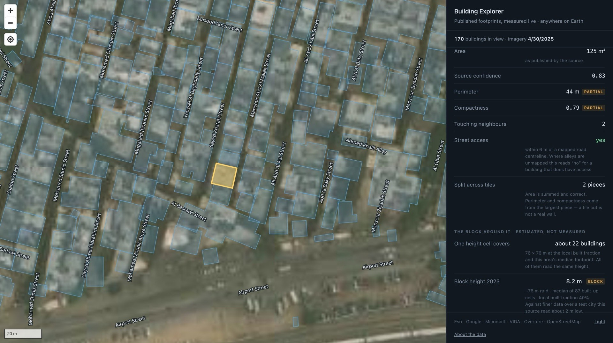

<div align="center">

# Global Building Explorer

**Every building on Earth, on one map — with its measurements, its height, and its
neighbours.**

One HTML file. No server, no database, no build step.

[](https://ali-ezz.github.io/building-explorer/)

[](LICENSE)
[](CHANGELOG.md)
[](index.html)
[](#hosting-it-yourself)
[](#where-this-came-from)

</div>



<sub>Imbaba, Giza. Imagery © Esri World Imagery. Building outlines © Google, Microsoft
and Overture contributors.</sub>

---

## Try it in thirty seconds

1. **[Open it](https://ali-ezz.github.io/building-explorer/)** — it lands over Imbaba, Cairo.
2. **Click any building.** Its record opens: area, perimeter, compactness, how many
   buildings physically touch it, whether it fronts a street.
3. **Switch Buildings to "In selection", drag a rectangle.** You get the neighbourhood's
   density, coverage and block complexity.
4. **Press "Download all".** A ZIP lands with the two-colour mask, the instance mask, the
   footprints as GeoJSON, the statistics as CSV, and world files so it opens in QGIS in
   the right place.

Nothing is uploaded and nothing is stored. Everything above is computed in your browser.

---

## What it does

### On the map

**Click any building** and read its record: footprint area, perimeter, compactness,
the **exact number of buildings physically touching it**, height in 2023 and 2020, an
estimate of storeys, and its share of the built volume around it.

**Travel in time.** The imagery slider moves through Esri's archive from 2014 to 2026.
Where two years turn out to be the same photograph, the app says so rather than
letting you wonder why nothing changed.

**Find the best picture, not the newest one.** The archive holds 196 releases and the
newest is a publication order, not a quality order. "Sharpest here" searches it for
*this* ground — over Kibera it finds imagery 1.6× sharper and twice as well placed as
the one on screen.

**Go anywhere.** Search any place on Earth, or use the find-me button when you are
standing in the area you are surveying. The map position lives in the URL, so a view can
be sent to a colleague as a link.

**Read it in English.** Street and place names appear in English wherever the data has
one, and are romanised character by character where it does not, so Greek, Cyrillic,
Arabic, Persian, Hebrew, Thai and Devanagari all render in Latin script.

### As an instrument

**Measure a neighbourhood.** Drag a rectangle and get its count, density, footprint
distribution, how much ground is actually under a building, and **block complexity** —
the published metric for how many parcels you must cross to reach a street, from
*Infrastructure deficits and informal settlements in sub-Saharan Africa* (Nature, 2025).
k = 1 is a planned block; k = 5+ is a severe access deficit.

**Take it away as a deliverable.** One ZIP: a two-colour mask with touching buildings
separated by a one-pixel seam, a colour instance mask on the same grid, the footprints
as GeoJSON, every figure as CSV, and world files plus `.prj` so it lands correctly in
QGIS. Rendered in EPSG:3857, to match the imagery it was traced from.

### With your own data

**Bring your own imagery.** A GeoTIFF lands at its own coordinates — WGS84, Web Mercator
or **any UTM zone**, read from the file's own header and reprojected. A drone JPEG is
placed from its EXIF GPS. A plain photograph you place, then snap to the imagery by
correlation. Everything the app knows about that ground comes back on *your* file's exact
pixel grid, so the mask drops onto it one pixel to one pixel.

**Bring your own polygons.** GeoJSON, KML and CSV (points or WKT) are scored building by
building against the published data — which agree, which you have and they do not, which
they have and you do not. Matched by centroid-inside-polygon, not by overlapping boxes.

**Read the picture itself.** A public 15 MB segmentation model, run in the browser on
your own image — the one place this app looks at pixels rather than re-serving what
someone else traced. Its result is always scored against the published footprints and
never shown alone, because its quality on dense informal fabric is unmeasured.

Works on a phone, a tablet and a desktop, in a light or a dark theme.

---

## Measured, or estimated — the panel never blurs the two

| | |
|---|---|
| **Measured** | footprint geometry, area, perimeter, compactness, touching neighbours, counts, density, coverage, block complexity, the source's own confidence |
| **Estimated** | **height** — from a ~76 m grid, so it describes the block rather than the individual roof, and reads about 2 m low against finer data; **floors** — height ÷ 3.0 m, an estimate built on an estimate; **population share** — each building's share of the local built volume, to multiply by a total you trust, and **never a headcount** |

Every estimated figure carries that caveat in the panel itself, next to the number.

---

## A few things worth knowing, all of them measured

**Two open datasets often draw the same roof.** At zoom 17, the share of Overture
polygons sitting on a building the other source had already drawn was 74% over Imbaba,
90% over Cairo and 71% over Lagos — which is why buildings appeared to carry several
outlines stacked on them. Neither source can simply be dropped, because which one is
better flips by place: 634 buildings against 208 over Imbaba, but 32 against 253 over
Paris, and none at all over Beijing. The explorer draws the denser product for the
current view, so no roof is outlined twice, and the other is one click away under
**Sources** — where turning both on is an explicit choice to see where they disagree.

**Position is bounded by the imagery, not by the outline.** Measured across 32 places:
aerial-survey cities (Johannesburg, New York, Berlin) are accurate to 0.4–0.6 m, and
satellite coverage — most of the world — to **8.47 m**. A footprint traced from a
picture inherits that picture's accuracy however precise its outline looks. The panel
says so, per area, next to the numbers it bounds.

**Some imagery years are the same photograph.** Comparing tile bytes over Imbaba, 2014,
2015 and 2016 are identical, and so are 2025 and 2026 — thirteen year options, ten real
captures. Which years collide depends on where you are, so it is resolved per tile.

**Building outlines date from about 2023** while the imagery may be older or newer. On a
2014 basemap you are looking at today's buildings over yesterday's ground, and the panel
warns you when the two drift apart.

---

## Data and licences — attribution is required, please keep it

| Layer | Source | Licence |
|---|---|---|
| Buildings | Google Open Buildings + Microsoft, combined by VIDA | CC BY-4.0 |
| Buildings | Overture Maps | ODbL / CC BY-4.0 |
| Height, density | Microsoft Building Density | CDLA-Permissive-2.0 |
| Imagery | Esri World Imagery Wayback | Esri terms |
| Roads, divisions | Overture Maps / OpenStreetMap | ODbL |
| Place search | Nominatim / OpenStreetMap | ODbL |
| Segmentation model | geobase, via geoai.js | MIT |

The **About the data** panel in the app carries the same credits, and so does the README
inside every export. Keep them in any copy you publish or redistribute. Full detail, with
links and the software licences, is in **[ATTRIBUTION.md](ATTRIBUTION.md)**.

**Requires an internet connection.** Nothing is bundled — every layer streams from its
publisher at the moment you look at it. That is what keeps one file covering the whole
planet, and it also means the app cannot work offline.

Two libraries are fetched only when they are needed rather than on every page load:
**geotiff.js** when you click a building or open a GeoTIFF, and **ONNX Runtime Web**
plus the 15 MB model only if you ask it to read your own picture.

---

## Where this came from

Built at **NARSS** (National Authority for Remote Sensing and Space Sciences, Egypt).

The explorer is the delivered product of a much larger study on **segmenting individual
buildings in dense informal settlements** — the case that breaks most methods, because
neighbouring buildings share walls and there is no gap between them to detect. That work
involved fine-tuning segmentation models on Kaggle, testing several instance-separation
approaches against one another, measuring the resolution ceiling of freely available
imagery, and validating against independent building footprints.

Two results from it shaped this app directly, and are worth stating plainly:

- **A fine-tuned model added about 9.5% over the public building data**, at roughly 50%
  precision — and separated touching buildings *worse* than the public data already
  does. At 0.26 m per pixel, the bottleneck is not the model.
- **0.26 m per pixel is the ceiling** for free imagery over the study area. Esri matches
  Google, Bing and Yandex are worse, there is no genuine zoom 20, and multi-frame
  super-resolution did not recover detail.

Which is why this explorer is built on the best available public data rather than on a
model — a conclusion reached by measurement, not assumption.

The research repository — experiments, the full findings log, training notebooks and
validation — is maintained separately and is not public.

---

## Working on it

**This repository is the working copy.** `index.html` originated from a generator in the
private project repository, but it is edited directly here now and the history is commits
against this file.

```bash
git add index.html && git commit -m "..." && git push origin main
```

GitHub Pages rebuilds within a minute or two.

> ⚠️ **Do not `git subtree push` over this repository from the private side.** Work now
> exists only here, and a subtree push would silently overwrite it. If the generator is
> ever re-run, merge this file into it rather than over it.

There is no build step and no test runner in this repository — it is one document. Open
`index.html` from any static server and drive it:

```bash
python3 -m http.server 8765     # then open http://localhost:8765/index.html
```

## Hosting it yourself

It is one static file. Any web server works — drop `index.html` anywhere and open it.
There is nothing to configure and nothing to keep running.

---

## Licence

The viewer code is **MIT** — see [LICENSE](LICENSE). The map data it displays is not
covered by that grant; each layer keeps its own licence, listed in
[ATTRIBUTION.md](ATTRIBUTION.md).

## Citing this

A [CITATION.cff](CITATION.cff) is included, so GitHub's "Cite this repository" button
produces a formatted reference. If you use the explorer or its outputs in published
work, please cite it.
